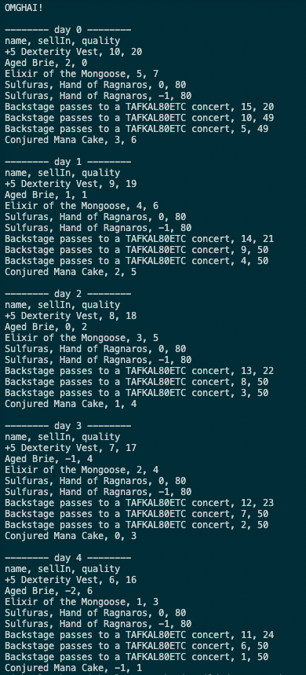

# Gilded Rose Tech Test

This is an Individual Technical Challenge at Week 10 in Makers Academy Bootcamp.

Link to all Individual technical challenges: https://github.com/makersacademy/course/tree/main/individual_challenges

## Technologies used
This program runs on Node.js with Javascript.
Testing was done by Jest and ESLint.

## Installation
You can run the program by downloading it from the GitHub repository and install it locally:
```
git clone https://github.com/michaelcychan/gilded-rose-tech-test.git
cd gilded-rose-tech-test
npm install
```

## Running the program
There is a example code that you can have a look of this program. You can run it using Node.js:
```
node ./test/texttest_fixture.js
```
Currently it will print 10 days of the item data.


## Tests
Use the following commands:
```
npm run test:all
```


## Original Program
According to the source, Conjured Mana Cake is a new addition to the Inn, therefore the computer program could not handle its SellIn and Quality correctly.



The Conjured Mana Cake, a new addition to the Inn, could not be handled correctly by the original program. The calculation of the quality of the conjured item does not match the specification.
However, the original program was written in a way that adding new logic is difficult. Substantial refactoring was needed before any new logic can be brought in to handle any additional items.

## Approach
The problem with the original program was that it was not very readable. The logic for different items were interwined. 

### Building tests for existing items using original programs
In order to ensure any change of the code would not affect the original logic, test cases are essential. Fortunately there was a provided file, texttest_fixture.js, which would run the program and print out the quality changes of different items. 

I first printed out the quality changes of items in the next 10 days. Before bringing any changes to the code, I built passing tests that expects the values of all items at day 1 and day 10 milestone. These tests became my guides for any future change of the codes. If any of my changes fails these tests, that means my changes have altered the logic of the program and this particular change has to be reverted.

### Refactoring
As mentioned, the original codes were not very readable, substantial refactoring was needed. The != ('not' operator) was used very often, there were several deeply nested if statements, which were difficult for human eyes to read and to understand.
I first tried to group logics of the same item together. Redundant if statements were removed, logics handling similar items were placed together. At each change, the test would be run to ensure the original logic is not affected.
Eventually, logics for different items were separated. However, using nested if statement would be difficult for myself and any later developers to read, I decided to introduce switch case for different items.

### Switch Statement
As different items require different logic to track their quality change, in order for easier addition of logic for new items without affecting the existing logic, I decided to use switch statement to replace if statements because it is easier to understand and also very easy to add new logics without affecting the existing ones.

The basic structure of the current code structure is as follows:
```
switch(item.name) {
        case "Aged Brie":
         ...
          break;
        case "Backstage passes to a TAFKAL80ETC concert":
          ...
          break;

        ...
        default:
          ...
```
Any new addition can be added as a new case. If amendment of current logic is also easier as they are more readable.

## Further Issues
Currently there is only "conjured" item, if there is another new "conjured" item and the quality change is same as the Conjured Mana Cake, the program will not work again. Further work can be done to match if the item name starts with the string "Conjured". However, as it is not known if the next item would contain a fixed keyword, it is better to amend the code when more information is available.